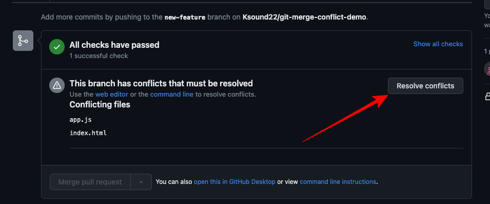
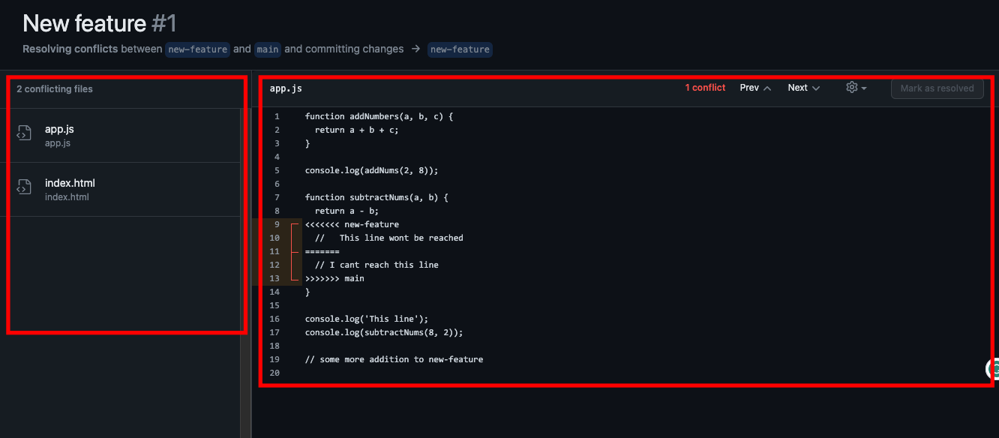

### Tips - 23

<h2><span style="color:#F6635C;font-weight:700;font-size:25px">
   🎅 How to Resolving Merge Conflicts ?
</span></h2>

#### 🎥 Tutorial Resolving Merge Conflicts (With Example): **([👉Click Here](https://youtu.be/nfOxUaA2trY))**






#### 🤧 What is a Git Merge Conflict?
A merge conflict is an event that takes place when Git is unable to automatically resolve differences in code between two commits. Git can merge the changes automatically only if the commits are on different lines or branches.

The following is an example of how a Git merge conflict works:


Let’s assume there are two developers: Developer A and Developer B. Both of them pull the same code file from the remote repository and try to make various amendments in that file. After making the changes, Developer A pushes the file back to the remote repository from his local repository. Now, when Developer B tries to push that file after making the changes from his end, he is unable to do so, as the file has already been changed in the remote repository.

To prevent such conflicts, developers work in separate isolated branches. The Git merge command combines separate branches and resolves any conflicting edits.

#### ✍️ Step by Step Blog to Resolve Merge Conflicts : **([👉Click Here](https://www.freecodecamp.org/news/how-to-fix-merge-conflicts-in-git/))**


#### 🍂 Some Git Commands to Resolve Merge Conflicts

```code
  👉 Format : git log --merge
  ✍️ This command helps to produce the list of commits that are causing the conflict.
```

```code
  👉 Format : git diff 
  ✍️ This command helps to identify the differences between the states repositories or file
```

```code
  👉 Format : git checkout 
  ✍️ This command is used to undo the changes made to the file, or for changing branches..
```

```code
  👉 Format : git reset --mixed 
  ✍️ This command is used to undo changes to the working directory and staging area
```

```code
  👉 Format : git reset --mixed 
  ✍️ This command helps in exiting the merge process and returning back to the state before the merging began.
```

```code
  👉 Format : git reset
  ✍️ This command is used at the time of merge conflict to reset the conflicted files to their original state.
```

```code
  👉 Format : git status
  ✍️ This command displays the current state of the working directory and the repository. 
  ✍️ It shows which files are modified, untracked, or staged for commit.
```


```code
  👉 Format : cd documentss
  ✍️ 'cd' is used to change the current working directory in the command line.. 
```
```code
  👉 Format : cat file.txt
  ✍️ 'cat' stands for "concatenate" and is used to display the contents of a file.. 
```
```code
  👉 Format : vi example.txt
  ✍️ 'vi' is a text editor available on Unix-like operating systems. 
  ✍️ It allows you to create and edit files from the command line.
```
```code
  👉 Format : git rebase origin master
  ✍️ This command is used to reapply commits on top of another branch 
  (usually master) to incorporate changes and keep a linear commit history.. 
```
```code
  👉 Format : git rebase --abort
  ✍️ This command aborts an ongoing rebase operation, 
  reverting the repository back to its original state before the rebase. 
```
```code
  👉 Format : git merge branch-name
  ✍️ This command merges changes from one branch into another. 
```
```code
  👉 Format : git mergetool
  ✍️ This command launches a merge resolution tool
   to help resolve conflicts during a merge or rebase. 
```
```code
  👉 Format : git rebase --continue
  ✍️ This command continues a rebase operation after 
  resolving conflicts in the conflicted files.
```


<hr>