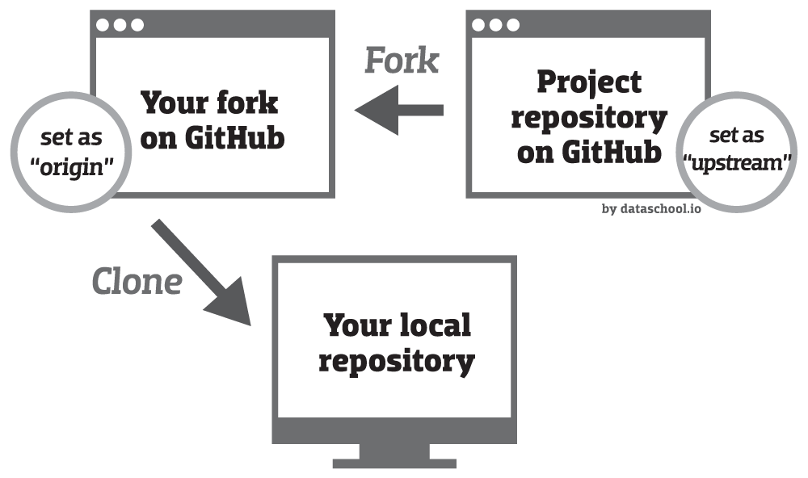

### Tips - 22

<h2><span style="color:#5B9A8B;font-weight:700;font-size:30px">
  💁 Contribute to Open Source repository in GitHub
</span></h2>

#### ✍️ Step-by-step guide to contributing on GitHub  : **([👉Click Here](https://www.dataschool.io/how-to-contribute-on-github/))**
#### ✍️ Example Code Overview of Contributing to an existing repository  : **([👉Click Here](https://docs.github.com/en/get-started/using-git/about-git#example-contribute-to-an-existing-repository))**

#### 🎥 Video Tutorial - How To Contribute in 3 Minutes : **([👉Click Here](https://youtu.be/jRLGobWwA3Y))**


<hr>


#### 😊 Step 1: Fork The Repository
###### 🎥 Fork a git repository : **([👉Click Here](https://youtu.be/NZIsGcCtvzw))**
```code
➡️ Find the project's repository on GitHub
➡️ Then "fork" it by clicking the Fork button in the upper right corner

This creates a copy of the project repository in your GitHub account. 
In the upper left corner, you will see that you are now looking at a repository in your account:
```


#### 😏 Step 2: Clone your forked repository

###### 🎥 Clone a repository with GitHub Desktop  : **([👉Click Here](https://youtu.be/PoZNIbs_wx8))**
```code
➡️ While still in your repository, click the green Clone or download button 
and then copy the HTTPS URL

Using Git on your local machine, clone your fork using the URL you just copied: 
" git clone URL_OF_FORK "
```


**Clone** the repository you want to contribute from in your machine ( Copy the repository Link and Write the following code in **Git Bash** )
```code
git clone https://github.com/Sumonta056/GitHub-Tutorial.git
```

#### 🍔 Step 3: Navigate to Your Local Repository
Since the clone was downloaded into a subdirectory of your working directory, you can navigate to it using:

```code
cd GitHub-Tutorial
```

#### 🌭 Step 4: Check that your fork is the "origin" remote
You are going to be synchronizing your local repository with both the project repository (on GitHub) and your fork (also on GitHub). The URLs that point to these repositories are called "remotes". More specifically, **the project repository is called the "upstream" remote, and your fork is called the "origin" remote.**

When you cloned your fork, that should have automatically set your fork as the "origin" remote. 
**Use git remote -v to show your current remotes**

```code
git remote -v
```
You should see the URL of your fork (which you copied in step 2) next to the word "origin".

If you don't see an "origin" remote, you can add it using: git remote add origin **URL_OF_FORK**.

```code
git remote add origin https://github.com/Sumonta056/GitHub-Tutorial.git
```

#### 🍿 Step 5: Add the project repository as the "upstream" remote

Add the project repository as the "upstream" remote using: git remote add upstream URL_OF_PROJECT.

```code
git remote add upstream https://github.com/scikit-learn/scikit-learn.git
```

#### 🥗 Summary of Step 1 - 5



#### 🥪 Step 6:  Pull the latest changes from upstream into your local repository

Before you start making any changes to your local files, it's a good practice to first synchronize your local repository with the project repository. Use git pull upstream master to "pull" any changes from the "master" branch of the "upstream" into your local repository. (If the project repository uses "main" instead of "master" for its default branch, then you would use git pull upstream main instead.)

```code
git pull upstream master
```
```code
git pull upstream main
```

If you forked and cloned the project repository just a few minutes ago, it's very unlikely there will be any changes, in which case Git will report that your local repository is "already up to date". But if there are any changes, they will automatically be merged into your local repository.


#### 🥩 Step 7:  Create a new branch

Rather than making changes to the project's "master" branch, it's a good practice to instead create your own branch. This creates an environment for your work that is isolated from the master branch.

1. **Create a new branch to store any new changes**
```code
git branch branch-name
```

2. **Switch to that branch you created**
```code
git checkout branch-name
```

Use git branch to show your local branches. You should see your new branch as well as "master", and your new branch should have an asterisk next to it to indicate that it's "checked out" (meaning that you're working in it).

```code
git branch
```

#### 🌮 Step 8:  Make changes in your local repository
Use a text editor or IDE to make the changes you planned to the files in your local repository. Because you checked out a branch in the previous step, any edits you make will only affect that branch.


#### 🍢 Step 9:  Commit your changes

After you make a set of changes, use git add . to stage your changes and git commit -m "DESCRIPTION OF CHANGES" to commit them.
Make changes. For example,  I am creating a two file "file1.md" and "file2.md"

1. **Select the changed files**
```code
git add file1.md file2.md
```

2. **Take a snapshot of the staging area (anything that's been added)**
```code
git commit -m "my snapshot"
```

If you are making multiple sets of changes, it's a good practice to make a commit after each set.


#### 🫕 Step 10: Push your changes

When you are done making all of your changes, upload these changes to your fork using git push origin BRANCH_NAME. This "pushes" your changes to the "BRANCH_NAME" branch of the "origin" (which is your fork on GitHub).

**Use any of the following code of pushing to repository**
```code
git push origin branch-name
```
```code
git push --set-upstream origin my-branch
```


#### 🍪 Step 11:  Begin the pull request

Return to your fork on GitHub, and refresh the page. You may see a highlighted area that displays your recently pushed branch:


Click the green **Compare & pull request** button to begin the pull request.

(Alternatively, if you don't see this highlighted area, you can switch to your branch using the Branch button and then click the New pull request button.)

#### 🥖 Step 12:  Create the pull request

###### ✍️ How to create a pull request in GitHub  : **([👉Click Here](https://opensource.com/article/19/7/create-pull-request-github))**

###### 🎥 Video Tutorial - How To Pull Request in 3 Minutes : **([👉Click Here](https://youtu.be/jRLGobWwA3Y?t=111))**

#### 🎊 Step 13:  Congratulations!

**Congratulations on making your first open source contribution! 🎉** 

<hr>

#### 🍂 Tips for contributing in Open Source Project

If you're ready to start making code contributions (beyond just fixing typos), here are a few tips:

1. Browse through a repository's open issues (especially ones labeled "good first issue") to see if there is an issue you might be able to solve.
2. If you're planning to contribute code that is unrelated to an existing issue, it's a good idea to open a new issue describing your proposal before starting work on it. The project maintainers might give you feedback that will help to shape your work, which will ultimately increase the likelihood that your pull request will be accepted.
3. Read the project's contributing guide, which will usually be in the GitHub repository or the project documentation. It will likely contain many helpful tips for how to successfully contribute to the project.ing your first open source contribution!
<hr>

#### 🥶 Collaboration with Others

###### 📺 Video Tutorial : How to do Collaboration **([👉Click Here](https://www.youtube.com/watch?v=nS9QbJt4KaQ))**
###### 🎥 How to give access permissions of your repository to other **([👉Click Here](https://youtu.be/nS9QbJt4KaQ?t=380))**


<hr>