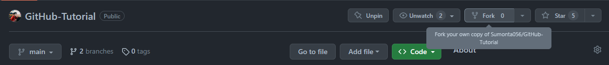
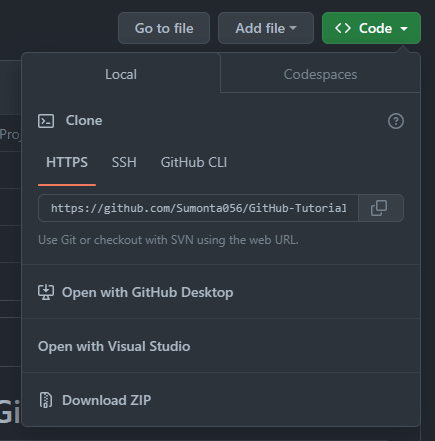
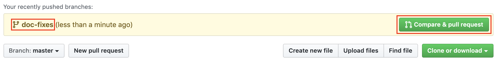
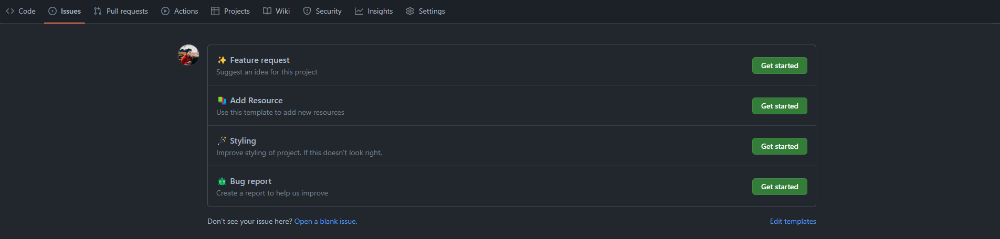
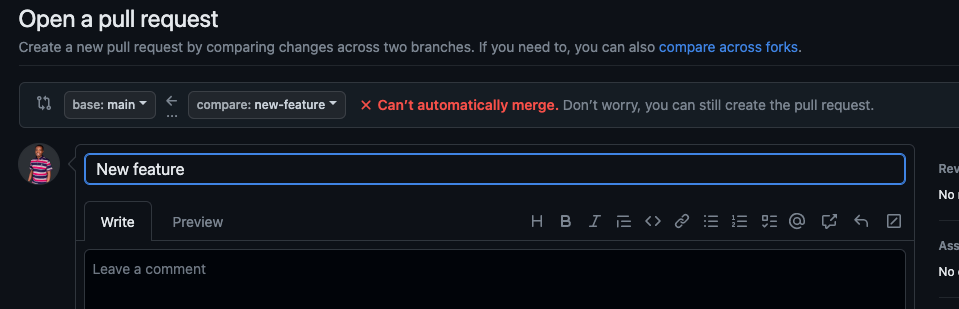
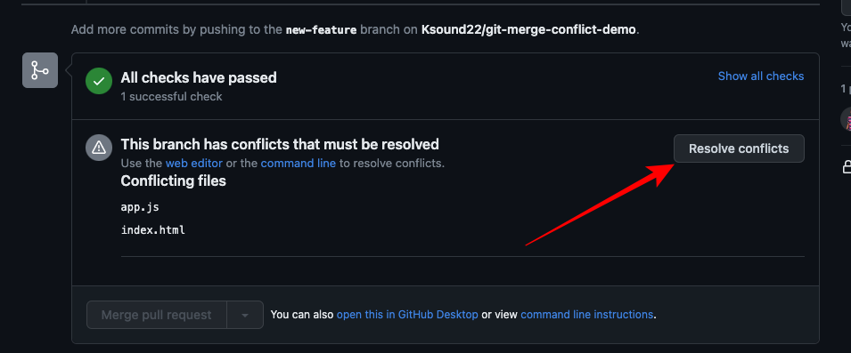
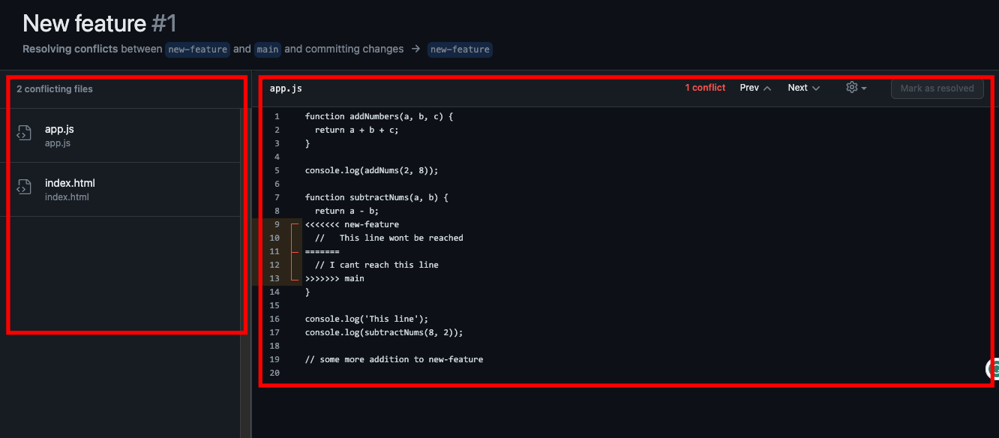
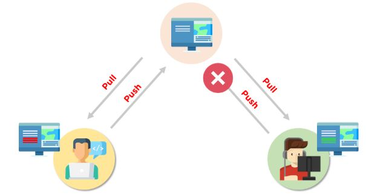
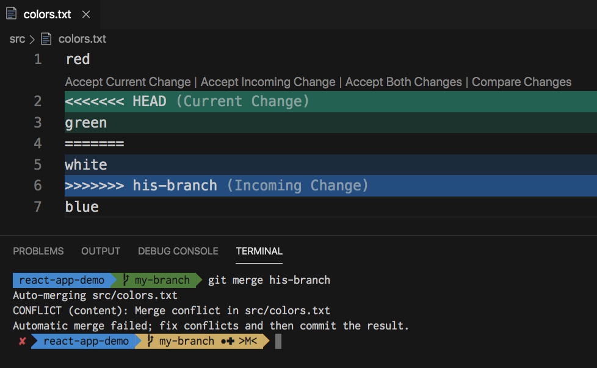
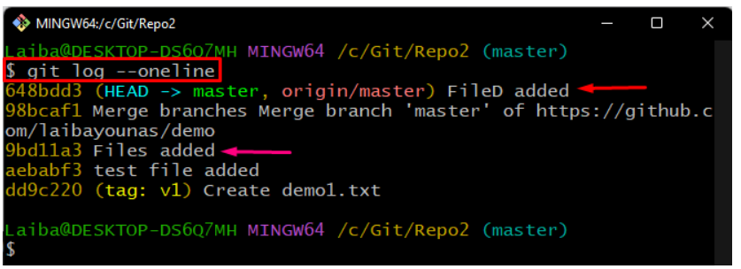

<h1>  Learn Everything About Git and GitHub</h1>

<hr>

<h3><span style="color:#674747;font-weight:700;font-size:30px">
    👉 Click The Desire Content
</span></h3>

## Content List

- **[💻 Installation ](#tips---1)**
- **[🧑‍💻 Setting up Git Environment ](#tips---2)**
- **[🔔 Git Commands List ](#tips---3)**
- **[⬆️ Upload a file or folder to Github ](#tips---4)**
- **[🤡 Clone a Git repository](#tips---5)**
- **[👊 Push a file to remote repository](#tips---6)**
- **[👨‍🔧Track or Unstage a file in local repository](#tips---7)**
- **[🔀 Revert or Undo any commit](#tips---8)**
- **[🌳 Git Branching](#tips---9)**
- **[🥱 Git Pull - Fetch - Merge](#tips---10)**
  - **[🌿 Update a branch from main branch ](#tips---11)**
  - **[🏠 Update a main branch in local repository](#tips---12)**
  - **[🤞 Git Pull vs Fetch-Merge](#tips---13)**
- **[🌚 Create a Pull Request](#tips---14)**
- **[🕸️ Hosting a website using GitHub Pages](#tips---15)**
- **[👑 How to write commit message like PRO](#tips---16)**
- **[✌️ Git Commit Message Type](#tips---17)**
- **[🥹 GitHub Related Problems and Solutions](#tips---18)**
   - **[⚠️ Git Server Connection Error : Fixed](#tips---18)**
   - **[⛑️ Restore a Deleted Depository](#tips---18)**
- **[🍕 How to make a Git Commit with a Past Date](#tips---19)**
- **[🤷‍♀️ What is Git-Ignore and How To Use It ! ](#tips---20)**
- **[🎀 How To Add Video, Audio and GIFs Files directly in README.md File ](#tips---21)**
- **[💁 Contribute to Open Source repository in GitHub ](#tips---22)**
   - **[🍔 Fork and Clone Repository ](#tips---22)**
   - **[🌭 Remote "Origin" and "UpStream"](#tips---22)**
   - **[🍿 Pull and Push change to upstream ](#tips---22)**
   - **[🥗 Create new branch for contributing](#tips---22)**
   - **[🥪 Create a pull request ](#tips---22)**
   - **[🥩 Tips for contributing in Open Source Project ](#tips---22)**
   - **[🥶 Collaboration with Others ](#tips---22)**
   - **[🌮 How to give access permissions of your repository to other ](#tips---22)**
   - **[😷 Wrtting a Issue in the Project Repository ](#tips---22)**
   - **[🤯 Resources for Finding an Open-Source Program Contribution ](#tips---22)**
- **[ 🎅 How to Resolving Merge Conflicts ?](#tips---23)**
- **[ ⚔️ How To Edit Pushed Git Commit Message?](#tips---24)**
   - **[ ❤️‍🩹 Edit The ⭐ Last ⭐ Pushed Git Commit Message](#tips---24)**
   - **[ 🍂 Edit The ⭐ Any ⭐ Pushed Git Commit Message](#tips---24)**
- **[ 🫀 How to Roll Back ( Git Reset vs Revert ) a Git Repository to a Particular Commit ](#tips---25)**
   - **[ 🫁 How to Reset a Git Repository to a Specific Commit](#tips---25)**
   - **[ 😮‍💨 How to Revert a Git Repository to a Specific Commit](#tips---25)**
- **[ 🤕 Ignore Files Using : .gitignore (How to use the gitignore file) ](#tips---26)**

<hr>

### Tips - 1

<h2><span style="color:green;font-weight:700;font-size:30px">
    💻 Installation
</span></h2>

- How to **Create GitHub Account** Step by Step (**[👉Tutorial Link](https://youtu.be/QUtk-Uuq9nE)**)
- Git (**[👉Download](https://git-scm.com/downloads)**)
- How to **install Git** Step by Step (**[👉Tutorial Link](https://phoenixnap.com/kb/how-to-install-git-windows#ftoc-heading-1)**)
- GitHub Desktop (**[👉Download](https://desktop.github.com/)**)
- How to **install GitHub Desktop** Step by Step (**[👉Tutorial Link](https://www.youtube.com/watch?v=RPagOAUx2SQ)**)

[](#content-list)


### Tips - 2

<h2><span style="color:#541690;font-weight:700;font-size:30px">
    🧑‍💻 Setting up Git Environment
</span></h2>

#### 🎥 Video Tutorial : **([👉Click Here](https://www.youtube.com/watch?v=yDntCIs-IJM))**

1. Open Git Bash
2. Write The Following Commands

   - **Set Name** : `git config --global user.name "Gihub User Name"`
   - **Set Email** : `git config --global user.email "Github Email"`
   - **Check status** : `git config --list`

3. Setting Done Successfully

[](#content-list)

### Tips - 3

<h2><span style="color:#0B666A;font-weight:700;font-size:29px">
  🔔 Git Commands List
</span></h2>

| **Command** | **Description** |
| --- | --- |
| **👉 git init** | **✍️ Initialize a new repository** |
|              | `git init` |
| **👉 git clone** | **✍️ Clone a remote repository** |
|              | `git clone https://github.com/example/repo.git` |
| **👉 git add** | **✍️ Stage file changes** |
|              | `git add file.txt` |
|              | `git add .` |
| **👉 git commit** | **✍️ Commit changes with a descriptive message** |
|              | `git commit -m "Added new feature` |
| **👉 git status** | **✍️ Check repository status** |
|              | `git status` |
| **👉 git push** | **✍️ Push committed changes to a remote repository** |
|              | `git push origin main` |
| **👉 git pull** | **✍️ Fetch and merge changes from a remote repository** |
|              | `git pull origin main` |
| **👉 git branch** | **✍️ List of all branches** |
|              | `git branch` |
| **👉 git checkout** | **✍️ Switch to a different branch** |
|              | `git checkout new-feature` |
| **👉 git merge** | **✍️ Merge a branch into the current branch** |
|              | `git merge new-feature` |
| **👉 git log** | **✍️ View git commit history** |
|              | `git log` |
| **👉 git remote** | **✍️ Add remote repository** |
|              | `git remote add upstream https://github.com/upstream/repo.git` |
| **👉 git diff** | **✍️ Show differences between files** |
|              | `git diff file1.txt file2.txt` |
| **👉 git reset** | **✍️ Unstage a file** |
|              | `git reset file.txt` |

[](#content-list)

### Tips - 4

<h2><span style="color:#EB455F;font-weight:700;font-size:30px">
    ⬆️ Upload a file/folder to Github
</span></h2>

##### 🎥 Video Tutorial : **([👉Click Here](https://www.youtube.com/watch?v=eGaImwD8fPQ))**

##### ✍️ Blog Guide Step by Step : **([👉Click Here](https://phoenixnap.com/kb/how-to-use-git#ftoc-heading-2))**

1. First **Create a repository** in Github : **([👉How To Create Repository : YouTube](https://www.youtube.com/watch?v=u-_uGO95xco))** **([👉Blog Link](https://phoenixnap.com/kb/how-to-use-git#ftoc-heading-5))**
2. Select the folder that you want to upload
3. Open Gitbash for that folder ( Right click on the folder and open git bash)
4. Now write the following Code in **Gitbash terminal**
5. Initialize it with git-specific functions : `git init`
6. Git isn't aware of these file, stage it : `git add .`
7. Take a snapshot of the staging area : `git commit -m "Commits Names"`
8. Select the master branch : `git branch -M main`
9. Provide the path for the repository you created on github : `git remote add origin " Git Repository Link"`
10. Push changes to github : `git push -u origin main`
11. **Use any of this if the above code not works**
    - `git push origin master --force`
    - `git push --set-upstream origin main`

[](#content-list)

### Tips - 5

<h2><span style="color:#5D9C59;font-weight:700;font-size:30px">
    🤡 Clone a git repository and push a file to that repository
</span></h2>

#### ✍️ Blog Link Step By Step: **([👉Click Here](https://phoenixnap.com/kb/how-to-install-git-windows#ftoc-heading-13))**

1. Copy the url link of the git repository
2. Open Git Bash and run the following command
3. Clone the repository : `git clone "RepositoryLink"`
   - **Code - 1 :** `git clone https://github.com/link.git`
   - Want to clone into **Specific Path**
     - Code Format : `git clone "RepositoryLink" "Location Path"`
     - Example : `git clone https://github.com/link.git  ./Test`
     - Note : `git init` to that folder
     - Clone to current folder: `git clone https://github.com/example/example.git ./`
4. **Code - 2 :** `cd "Git Repository Name"`
5. **Code - 3 :** `git remote -v`
6. (Folder Location) **Code - 4 :** `pwd`
   - pwd = print working directory
7. Create a new file in that location(text.txt)

[](#content-list)

### Tips - 6

<h4><span style="color:#647E68;font-weight:700;font-size:30px">
    👊 Push any files to the remote working directory
</span></h4>

8. Now check the status of your untracked files
   - **Code - 5 :**`git status`
9. Add your new file to the local project
   - **Code - 6 :**`git add text.txt`
10. Commit the changes to the local project
    - **Code - 7 :**`git commit -m "Commit Name"`
11. Finally, push the changes to the remote GitHub repository
    - **Code - 8 :**`git push"`
    - Force Push:`git push -f"`

[](#content-list)

### Tips - 7

<h4><span style="color:#F45050;font-weight:700;font-size:30px">
    👨‍🔧 Track an untracked file
</span></h4>

##### ✍️ Blog Link Step By Step: **([👉Click Here](https://phoenixnap.com/kb/how-to-use-git#ftoc-heading-6))**

1. Create a new file to in any local git repository
2. Check the new file is tracked or untracked
   - **Code - 1 :**`git status`
3. If untracked , then allow to track or stage the file
   - **Code - 2 :**`git add "file name"`
4. Now GitHub is tracking the file

<h4><span style="color:#89375F;font-weight:700;font-size:30px">
   ✈️ Unstage a tracked file
</span></h4>

1. Run git status to select which file you want to unstage
   - **Code - 1 :**`git status`
2. **Code - 2 :**`git reset -- "file name"`
3. Unstaging file successfully

[](#content-list)

### Tips - 8

<h2><span style="color:#7149C6;font-weight:700;font-size:30px">
    🔀 Revert or Undo any Commit
</span></h2>

##### ✍️ Blog Link Step By Step: **([👉Click Here](https://phoenixnap.com/kb/git-revert-last-commit#ftoc-heading-1))**

1. Indetifying the commit
   - **Code - 1 :**`git log`
2. Now copy the hash code of the commit want to revert
3. Write the following code
   - **Code - 2 :**`git checkout "Hash Code"`

[](#content-list)

### Tips - 9

<h2><span style="color:#5D9C59;font-weight:700;font-size:30px">
    🌳 Git Branching
</span></h2>

##### 🎥 Video Tutorial : **([👉Click Here](https://www.youtube.com/watch?v=8x7QcF9LG7I))**

##### ✍️ Blog Guide Step by Step : **([👉Click Here](https://phoenixnap.com/kb/how-to-use-git#ftoc-heading-10))**

##### 🆚 Branching Using VsCode : **([👉Click Here](https://phoenixnap.com/kb/how-to-use-git#ftoc-heading-10))**

##### 💻 Branching Using GitHub Desktop : **([👉Click Here](https://phoenixnap.com/kb/how-to-use-git#ftoc-heading-10))**

> ##### 🔛 Branching Using Git Bash👇

1. Check Current Branches
   - **Code - 1 :**`git branch`
2. **Create a new branch**
   - **Code - 2 :**`git branch New_Branch_Name`
3. **Switch to the new branch**
   - **Code - 3 :**`git checkout New_Branch_Name`
4. If you want to switch to a main branch
   - **Code - 4 :**`git checkout main`
5. Rename the branch you created
   - First Switch to the branch want to rename
   - **Code - 5 :**`git branch -m new-name`
6. **Delete a branch**
   - **Local Branch** : `git branch -d branch_name`
   - **Another Way** : `git push origin --delete branch_name`
   - **Remote Branch** : `git push origin --delete branch_name`
7. Check Branch Status
   - **Code - 6 :**`git branch`

[](#content-list)

### Tips - 10

<h2><span style="color:#5D9C59;font-weight:700;font-size:30px">
    🥱 Git Pull - Fetch - Merge
</span></h2>

<hr>

#### Tips - 11

<h4><span style="color:#E96479;font-weight:700;font-size:30px">
    🌿 Update a branch from main branch
</span></h4>

##### ✍️ Blog Link Step By Step: **([👉Click Here](https://stackoverflow.com/questions/20101994/how-to-git-pull-from-master-into-the-development-branch))**

#### 1️⃣ Way - 1 (Fetch-Merge)

1. Check Branch
   - **Code - 1 :**`git branch`
2. Choose the brance you want to update from main branch
   - **Code - 2 :**`git checkout Branch_Name`
3. Fetch Orgin or Maser Branch
   - **Code - 3 :**`git fetch origin`
4. Merge Orgin or Maser Branch into current branch
   - **Code - 4 :**`git merge origin`

#### 2️⃣ Way - 2 (Pull)

1. Check Branch
   - **Code - 1 :**`git branch`
2. Choose the brance you want to update from main branch
   - **Code - 2 :**`git checkout Branch_Name`
3. Pull from master branch
   - **Code - 3 :**`git pull origin master`

[](#content-list)

#### Tips - 12

<h4><span style="color:#6F1AB6;font-weight:700;font-size:30px">
    🏠 Update a main branch in local repository
</span></h4>

##### ✍️ Blog Link Step By Step: **([👉Click Here](https://phoenixnap.com/kb/how-to-use-git#ftoc-heading-18))**

#### 1️⃣ Way - 1 (Fetch-Merge)

1. Check Branch
   - **Code - 1 :**`git branch`
2. Choose the main brance
   - **Code - 2 :**`git checkout main`
3. Fetch Orgin or Maser Branch
   - **Code - 3 :**`git fetch `
4. Merge Orgin or Maser Branch
   - **Code - 4 :**`git merge`

#### 2️⃣ Way - 2 (Pull)

1. Check Branch
   - **Code - 1 :**`git branch`
2. Choose the brance main branch
   - **Code - 2 :**`git checkout Branch_Name`
3. Pull from master branch
   - **Code - 3 :**`git pull`
   - **Force Pull :**`git pull origin master`

[](#content-list)

#### Tips - 13

<h4><span style="color:#DC3535;font-weight:700;font-size:30px">
    🤞 Git Pull vs Fetch-Merge
</span></h4>

##### 🎥 Video Tutorial : **([👉Click Here](https://www.youtube.com/watch?v=KmagW60Li-o))**

[](#content-list)

### Tips - 14

<h2><span style="color:green;font-weight:700;font-size:30px">
    ⚓ Create a Pull Request
</span></h2>

> #### ✍️ Blog Link Step By Step: **([👉Click Here](https://phoenixnap.com/kb/how-to-use-git#ftoc-heading-18))**

> #### 🎥 Video Tutorial : **([👉Click Here](https://www.youtube.com/watch?v=jRLGobWwA3Y))**

1. Create a any file in  local repository
2. Switch to another or new brance from main branch
   - **Code - 1 :**`git checkout -b newbranch`
3. Check Branch
   - **Code - 2 :**`git branch`
4. Check files commit status
   - **Code - 3 :**`git status`
5. Stage untracked files
   - **Code - 4 :**`git add .`
6. Commit the untracked files
   - **Code - 5 :**`git commit -m "commit name"`
7. Push to remote repository with new branch
   - **Code - 6 :**`git push origin newbranch`
8. Now do the following Steps **[👉Click Here](https://www.youtube.com/watch?v=jRLGobWwA3Y)**


[](#content-list)

### Tips - 15

<h2><span style="color:#576CBC;font-weight:700;font-size:30px">
  🕸️ Hosting a website using GitHub
</span></h2>

##### 1️⃣ What is github pages ? : **([👉Click Here](https://phoenixnap.com/kb/how-to-use-git#ftoc-heading-18))**

##### 2️⃣ (Html - CSS - Javascript) Host a static website  : **([👉Click Here](https://www.youtube.com/watch?v=jRLGobWwA3Y))**


##### 3️⃣ (Only readme.md) Host a static website  : **([👉Click Here](https://phoenixnap.com/kb/how-to-use-git#ftoc-heading-18))**


##### 4️⃣ (NPM Based) Host a react website  : **([👉Click Here](https://phoenixnap.com/kb/how-to-use-git#ftoc-heading-18))**
> 🍀 **Setup NPM & NodeJs** **([👉Click Here](https://www.youtube.com/watch?v=mIW_8dMQaUk))**


[](#content-list)


### Tips - 16

<h2><span style="color:#F45050;font-weight:700;font-size:30px">
  👑 How to write commit message like PRO
</span></h2>

#### 🧐 Committing Ways

| **Basic Way** | **Advanced Way** |
| --- | --- |
| `git commit -m <message>` | `git commit -m <title> -m <description>` |

#### 🥱 Format :  [FEAT] Commit Message 

####  ✍️ 6 Steps to Write Better Commit Messages


##### 1️⃣ Capitalization & Punctuation
```Code
👉 Capitalize the first word and do not use in punctuation end
👉 Example :
    ❌❌ adding menu bar. 
    ✅✅ Adding menu bar  
```

##### 2️⃣ Show & Express Your Mood
```Code
👉 Use imperative mood in the subject line
👉 Example :
    ❌❌ dark mode toggle state 
    ✅✅ Add fix for dark mode toggle state  
```

##### 3️⃣ Specify The Type of Commit
```Code
👉 Use consistent set of words to describe your changes
👉 Example :
    ✅✅ Bugfix , Update , Refactor
```

##### 4️⃣ Think like a Journalist
```Code
👉 Be direct, try to eliminate filler words and phrases like (like : though, maybe, I think, kind of)
👉 Example :
    ❌❌ I added dark mode and maybe it has some issue 
    ✅✅ Add fix for dark mode toggle state  
```

##### 5️⃣ Add Emote Start of The Committ
```Code
👉 It creates a beautiful expression of the commit
👉 Example :
    ❌❌ Add fix for dark mode toggle state 
    ✅✅ ➕ Add fix for dark mode toggle state  
```

```Code
 ⚠️ NT : Since emojis use special ASCII codes (not commonly used and supported in the text-based interfaces like CLIs) and Unicode systems and most command-line interfaces need a third-party package or font to handle them, this convention might not look good to everyone. They might face some issues in terms of reading histories and checking the commit messages. (Like the emoji character in the message title might be rendered as its actual ASCII code or unknown question marks) 
```


##### 6️⃣ Convetional Keyword First
```Code
👉 Use a conventional Keyword first : Then explain the commit in detail
👉 Convetional Keywords like
    - feat , fix , chore
    - update , refactor , remove
    - docs , style 
    - test , build , revert
👉 Example :
    ❌❌ fixed bug on landing page 
    ✅✅ ➕ Fix: fix bug on landing page  
```

[](#content-list)

### Tips - 17

<h2><span style="color:#A5402D;font-weight:700;font-size:27px">
  ✌️ Git Commit Message Type
</span></h2> 

#### 🥱 Format :  [FEAT] Commit Message 


#### 1️⃣ Introducing New Features : "feat"

```code 
    👉 Format : git commit -m "feat: message"
```
**✍️ When you add an existing new feature, use 'feat' commit type. It helps team members identify and track significant changes easily.**

<hr>

#### 2️⃣ Fixing Bugs: "fix"

```code 
    👉 Format : git commit -m "fix: message"
```
**✍️ Addressing a bug ? Utlize 'fix' commit type to highlight that the commit resolves an issue or a problem in the repository code base**

<hr>

#### 3️⃣ Miscellaneous Changes: "chore"

```code 
    👉 Format : git commit -m "chore: message"
```
**✍️ For non-feature/non-fix updates like updating dependencies or performing routine tasks, use 'chore' commit type**

<hr>

#### 4️⃣ Code Refactoring : "refactor"

```code 
    👉 Format : git commit -m "refactor: message"
```
**✍️ When you improve the structure or readability of the code without adding features or fixing bugs, use 'refactor' commit type**

<hr>

#### 5️⃣ Documentation Updates: "docs"

```code 
    👉 Format : git commit -m "docs: message"
```
**✍️ Updating project documentation? Whether it's the README or other relevant files , 'docs' commit type keeps the documentation up to date**

<hr>

#### 6️⃣ Code Formatting: "style"

```code 
    👉 Format : git commit -m "style: message"
```
**✍️ For changes that don't affect code behavior but enhance code style or formatting , use 'style' commit type**

<hr>

#### 7️⃣ Testing Updates: "test"

```code 
    👉 Format : git commit -m "test: message"
```
**✍️ When you add or modify tests to ensure code quality and reliability , use 'test' commit type to keep track testing effort**

<hr>

#### 8️⃣ Performance Improvements: "perf"

```code 
    👉 Format : git commit -m "perf: message"
```
**✍️ Did you optimize the code to boost performance? Use 'perf' commit type**

<hr>

#### 9️⃣ Continuous Integration: "ci"

```code 
    👉 Format : git commit -m "perf: message"
```
**✍️ Changes related to continuous integration, such as configuring pipelines or adjusting build process, should use the 'ci' commit type**

<hr>

#### 🔟 Build System Updates: "build"

```code 
    👉 Format : git commit -m "build: message"
```
**✍️ For changes impacting the build system or external dependencies such as package updates or build script modification , use 'build' commit type**

<hr>

#### 1️⃣1️⃣ Reverting Changes: "revert"

```code 
    👉 Format : git commit -m "revert: message"
```
**✍️ Mistakes happen! if you need to undo a previous commit , use 'revert commit type to roll back changes and restore the previous states**

[](#content-list)

### Tips - 18

<h2><span style="color:#B8621B;font-weight:700;font-size:30px">
 🥹 GitHub Related Problems and Solutions 
</span></h2>

#####  1️⃣ Problem - 1 : Git Server Connection Error : Fixed
##### 🕵️ Description: *"Failed to connect to github.com port 443: Connection timed out"* when pushing to remote repository
* 👉 **Solution** :  Write the following command into GitBash
  - ```git config --global http.proxy```
  * ```git config --global --unset https.proxy```
<hr>

#####  2️⃣ Problem - 2 : Restore a Deleted Repository
##### 🕵️ Description: Mistakenly deleted an important repository
* 👉 **Solution** : Blog Link Step By Step **([👉Click Here](https://docs.github.com/en/repositories/creating-and-managing-repositories/restoring-a-deleted-repository))**

[](#content-list)

### Tips - 19

<h2><span style="color:#4A55A2;font-weight:700;font-size:25px">
   🍕 How to make a Git Commit with a Past Date
</span></h2>

#### 🎥 Video Tutorial : **([👉Click Here](https://youtu.be/cSwgkUHk_Qo))**

##### 👇 Command Line 👇

1. Add all file from current repository
   - **Code - 1 :**`git add .`
2. Stage all files using commit command
   - **Code - 2 :**`git commit -m "Commit Message Type"`
3. **To commit with your desire date use the following command with Time**
   - **Code - 3 :**`git commit --amend --date="2023-07-07 20:12:20"`
4. Git Gui will take you to another page
5. Now juust **press Esc and type :wq** then press Enter
6. Now push the commit
   - **Code - 4** : `git push origin master`
7. **Successfully committed with a random date**

[](#content-list)

### Tips - 20

<h2><span style="color:#DFA878;font-weight:700;font-size:25px">
   🤷‍♀️ What is Git-Ignore and How To Use It ! 
</span></h2>

#### ✍️ Blog Link Step By Step: **([👉Click Here](https://www.geeksforgeeks.org/what-is-git-ignore-and-how-to-use-it/?ref=lbp))**

#### 👇 What is git-ignore 👇
There are various types of files we might want the git to ignore before committing, for example, the files that are to do with our user settings or any utility setting, private files like passwords and API keys. These files are not of any use to anyone else and we do not want to clutter our git. We can do this with the help of “.gitignore”


.gitignore is an auto-generated file inside the project folder that ignores/prevents files to get committed to the local and remote repositories.
#### 👇 Command Line 👇

1. Create **.gitignore** File inside the project folder.
2. Assume I have files name
    - a.txt , b.txt , c.txt , text.txt
   
3. Write the name of the files you want to ignore in the .gitignore text file. Each file name should be written in a new line .
   - text.txt 
4. Initialize git in your terminal. Add these files to your git repository and commit all the changes with an appropriate message.
   - `git init`
   - `git add .`
   - `git commit - m "Testing Git Ignore"`
   - `git push`
5. Using **Git-Ignore** will not commit the file name text.txt further and commit the rest of files


#### 👇 Some common patterns and format for Git-Ignore 👇

- **Blank Line**: A blank line doesn’t refer to any file name, so we can use it to separate two file names for the ease of reading .

- **#**: A line beginning with the # symbol refers to a comment .However if # is used as a pattern then use backslash (“\”) before the # symbol so that it is not misunderstood as a comment.

- **/**: It is used as a directory separator i.e to include directories,  for example webdev/ .

- ***.extension_name**: For example *.txt and *.log can be used to match ALL the files that have .txt and .log as their extension respectively.

- ****/any_name**: It is used to match any file or directory with the name any_name.

- **any_name/****: It is used to match anything that is inside the directory of the name - any_name. for example webdev/** matches all the files inside webdev directory.

```code 

# Compiled class file                  // Comment
*.class                                // Ignore Extension Type

# Log file
*.log

# Mobile Tools for Java (J2ME)
.mtj.tmp/                              // Extension Directory Type      

# Package Files 
*.jar
```


[](#content-list)

### Tips - 21

<h2><span style="color:#7A316F;font-weight:700;font-size:25px">
   🎀 How To Add Video, Audio and GIFs Files directly in README.md File

</span></h2>

#### 🎥 Add Videos on README.md File: **([👉Click Here](https://www.geeksforgeeks.org/how-to-add-videos-on-readme-md-file-in-a-github-repository/?ref=lbp))**

#### 🎶 Add Audio on README.md File: **([👉Click Here](https://www.geeksforgeeks.org/how-to-add-audio-files-on-readme-md-file-in-a-github-repository-from-the-local-system/))**


#### 📸 Add Images on README.md File: **([👉Click Here](https://www.geeksforgeeks.org/how-to-add-images-on-readme-md-file-in-a-github-repository-from-the-local-system/))**


#### 💃 Add GIFs  on README.md File: **([👉Click Here](https://www.geeksforgeeks.org/how-to-add-gifs-on-readme-md-file-in-a-github-repository/))**


#### 🧠 Add images and links in Markdown by dragging and dropping in VSCode: **([👉Click Here](https://www.youtube.com/watch?v=jpeh1WorrWM))**


[](#content-list)


### Tips - 22

<h2><span style="color:#5B9A8B;font-weight:700;font-size:30px">
  💁 Contribute to Open Source repository in GitHub
</span></h2>

#### 📻 Video Guide - Contributing to Open Source  : **([👉Click Here](https://youtu.be/CML6vfKjQss))**


#### ✍️ Step-by-step guide to contributing on GitHub  : **([👉Click Here](https://www.dataschool.io/how-to-contribute-on-github/))**
#### ✍️ Example Code Overview of Contributing to an existing repository  : **([👉Click Here](https://docs.github.com/en/get-started/using-git/about-git#example-contribute-to-an-existing-repository))**

#### 🎥 Video Tutorial - How To Contribute in 3 Minutes : **([👉Click Here](https://youtu.be/jRLGobWwA3Y))**


#### 🏠 Open Source BootCamp - Master Open Source Contributions : **([👉Click Here](https://youtube.com/playlist?list=PLinedj3B30sAT6CotNj0iffhRV89SkNK9))**

#### 🔍 How to Find the Best Repositories for Open Source Contribution : **([👉Click Here](https://youtu.be/noKgvN_42Hk))**

#### 🔍 How to Earn with Open Source Contributions : **([👉Click Here](https://youtu.be/9AkfNuc_SZ4))**


#### 📭 Open Source Crash Course - Beginner Guide to Open Source : **([👉Click Here](https://youtu.be/o6xikISiz2w?si=WT9JVaWofvedFLtp))**


#### ✍️ Open Source Crash Course Notes : **([👉Click Here](https://app.eraser.io/workspace/PaI6tlInajtHXxgdKUiz))**

#### ✍️ Top 10 Mistakes in Open Source Contribution World  : **([👉Click Here](https://youtu.be/3ue4ZE7QBTk?si=79yHk0VRsW1b3Tqm))**


<hr>


#### 😊 Step 1: Fork The Repository
###### 🎥 Fork a git repository : **([👉Click Here](https://youtu.be/NZIsGcCtvzw))**
```code
➡️ Find the project's repository on GitHub
➡️ Then "fork" it by clicking the Fork button in the upper right corner

This creates a copy of the project repository in your GitHub account. 
In the upper left corner, you will see that you are now looking at a repository in your account:
```




#### 😏 Step 2: Clone your forked repository

###### 🎥 Clone a repository with GitHub Desktop  : **([👉Click Here](https://youtu.be/PoZNIbs_wx8))**
```code
➡️ While still in your repository, click the green Clone or download button 
and then copy the HTTPS URL

Using Git on your local machine, clone your fork using the URL you just copied: 
" git clone URL_OF_FORK "
```



**Clone** the repository you want to contribute from in your machine ( Copy the repository Link and Write the following code in **Git Bash** )
```code
git clone https://github.com/Sumonta056/GitHub-Tutorial.git
```

#### 🍔 Step 3: Navigate to Your Local Repository
Since the clone was downloaded into a subdirectory of your working directory, you can navigate to it using:

```code
cd GitHub-Tutorial
```

#### 🌭 Step 4: Check that your fork is the "origin" remote
You are going to be synchronizing your local repository with both the project repository (on GitHub) and your fork (also on GitHub). The URLs that point to these repositories are called "remotes". More specifically, **the project repository is called the "upstream" remote, and your fork is called the "origin" remote.**

When you cloned your fork, that should have automatically set your fork as the "origin" remote. 
**Use git remote -v to show your current remotes**

```code
git remote -v
```
You should see the URL of your fork (which you copied in step 2) next to the word "origin".

If you don't see an "origin" remote, you can add it using: git remote add origin **URL_OF_FORK**.

```code
git remote add origin https://github.com/Sumonta056/GitHub-Tutorial.git
```

#### 🍿 Step 5: Add the project repository as the "upstream" remote

Add the project repository as the "upstream" remote using: git remote add upstream URL_OF_PROJECT.

```code
git remote add upstream https://github.com/scikit-learn/scikit-learn.git
```

#### 🥗 Summary of Step 1 - 5


#### 🥪 Step 6:  Pull the latest changes from upstream into your local repository

Before you start making any changes to your local files, it's a good practice to first synchronize your local repository with the project repository. Use git pull upstream master to "pull" any changes from the "master" branch of the "upstream" into your local repository. (If the project repository uses "main" instead of "master" for its default branch, then you would use git pull upstream main instead.)

```code
git pull upstream master
```
```code
git pull upstream main
```

If you forked and cloned the project repository just a few minutes ago, it's very unlikely there will be any changes, in which case Git will report that your local repository is "already up to date". But if there are any changes, they will automatically be merged into your local repository.


#### 🥩 Step 7:  Create a new branch

Rather than making changes to the project's "master" branch, it's a good practice to instead create your own branch. This creates an environment for your work that is isolated from the master branch.

1. **Create a new branch to store any new changes**
```code
git branch branch-name
```

2. **Switch to that branch you created**
```code
git checkout branch-name
```

Use git branch to show your local branches. You should see your new branch as well as "master", and your new branch should have an asterisk next to it to indicate that it's "checked out" (meaning that you're working in it).

```code
git branch
```

#### 🌮 Step 8:  Make changes in your local repository
Use a text editor or IDE to make the changes you planned to the files in your local repository. Because you checked out a branch in the previous step, any edits you make will only affect that branch.


#### 🍢 Step 9:  Commit your changes

After you make a set of changes, use git add . to stage your changes and git commit -m "DESCRIPTION OF CHANGES" to commit them.
Make changes. For example,  I am creating a two file "file1.md" and "file2.md"

1. **Select the changed files**
```code
git add file1.md file2.md
```

2. **Take a snapshot of the staging area (anything that's been added)**
```code
git commit -m "my snapshot"
```

If you are making multiple sets of changes, it's a good practice to make a commit after each set.


#### 🫕 Step 10: Push your changes

When you are done making all of your changes, upload these changes to your fork using git push origin BRANCH_NAME. This "pushes" your changes to the "BRANCH_NAME" branch of the "origin" (which is your fork on GitHub).

**Use any of the following code of pushing to repository**
```code
git push origin branch-name
```
```code
git push --set-upstream origin my-branch
```


#### 🍪 Step 11:  Begin the pull request

Return to your fork on GitHub, and refresh the page. You may see a highlighted area that displays your recently pushed branch:



Click the green **Compare & pull request** button to begin the pull request.

(Alternatively, if you don't see this highlighted area, you can switch to your branch using the Branch button and then click the New pull request button.)

#### 🥖 Step 12:  Create the pull request

###### ✍️ How to create a pull request in GitHub  : **([👉Click Here](https://opensource.com/article/19/7/create-pull-request-github))**

###### 🎥 Video Tutorial - How To Pull Request in 3 Minutes : **([👉Click Here](https://youtu.be/jRLGobWwA3Y?t=111))**

#### 🎊 Step 13:  Congratulations!

**Congratulations on making your first open source contribution! 🎉** 

<hr>

#### 🍂 Tips for contributing in Open Source Project

If you're ready to start making code contributions (beyond just fixing typos), here are a few tips:

1. Browse through a repository's open issues (especially ones labeled "good first issue") to see if there is an issue you might be able to solve.
2. If you're planning to contribute code that is unrelated to an existing issue, it's a good idea to open a new issue describing your proposal before starting work on it. The project maintainers might give you feedback that will help to shape your work, which will ultimately increase the likelihood that your pull request will be accepted.
3. Read the project's contributing guide, which will usually be in the GitHub repository or the project documentation. It will likely contain many helpful tips for how to successfully contribute to the project.ing your first open source contribution!
<hr>

#### 🥶 Collaboration with Others

###### 📺 Video Tutorial : How to do Collaboration **([👉Click Here](https://www.youtube.com/watch?v=nS9QbJt4KaQ))**
###### 🎥 How to give access permissions of your repository to other **([👉Click Here](https://youtu.be/nS9QbJt4KaQ?t=380))**

<hr>

#### 😷 Wrtting a Issue in the Project Repository



###### ❓ What is GitHub Issues? **([👉Click Here](https://youtu.be/6HWw7rhwvtY?si=_tBYe0GAwPU0UgMR))**

###### 📺 Video Tutorial : How To Create Issue in Repository **([👉Click Here](https://www.youtube.com/watch?v=TKJ4RdhyB5Y))**
###### 🎥 How To Create Issue Templete in Own Repository **([👉Click Here](https://youtu.be/iCNA_zyawi8?si=wTEk13imWx4LNKz7))**


<hr>


#### 🤯 Resources for Finding an Open-Source Program Contribution

- **🔍 GitHub Explore : [ 👉 Click Here ](https://github.com/explore/)**
- **🎁 Up for Grabs : [ 👉 Click Here ](https://up-for-grabs.net/#/)**
- **🍁 HacktoberFest Projects : [ 👉 Click Here ](https://hacktoberfest.com/participation/)**
- **🌟 Ovio Projects  : [ 👉 Click Here ](https://ovio.org/project/coder/code-server)**
- **🚀 Good First Issues : [ 👉 Click Here ](https://goodfirstissue.dev/)**
- **🌐 Google Summer of Code : [ 👉 Click Here ](https://summerofcode.withgoogle.com/)**
- **🌈 Outreachy : [ 👉 Click Here ](https://www.outreachy.org/apply/eligibility/)**
- **🌌 MLH Fellowship : [ 👉 Click Here ](https://fellowship.mlh.io/)**
- **🌍 Google For Developers  : [ 👉 Click Here ](https://developers.google.com/)**
- **🌞 GNOME Summer of Code : [ 👉 Click Here ](https://gsoc.gnome.org/#small-contribution)**


[](#content-list)


### Tips - 23

<h2><span style="color:#F6635C;font-weight:700;font-size:25px">
   🎅 How to Resolving Merge Conflicts ?
</span></h2>

#### 🎥 Tutorial Resolving Merge Conflicts (With Example): **([👉Click Here](https://youtu.be/nfOxUaA2trY))**







#### 🤧 What is a Git Merge Conflict?
A merge conflict is an event that takes place when Git is unable to automatically resolve differences in code between two commits. Git can merge the changes automatically only if the commits are on different lines or branches.

The following is an example of how a Git merge conflict works:



Let’s assume there are two developers: Developer A and Developer B. Both of them pull the same code file from the remote repository and try to make various amendments in that file. After making the changes, Developer A pushes the file back to the remote repository from his local repository. Now, when Developer B tries to push that file after making the changes from his end, he is unable to do so, as the file has already been changed in the remote repository.

To prevent such conflicts, developers work in separate isolated branches. The Git merge command combines separate branches and resolves any conflicting edits.

#### ✍️ Step by Step Blog to Resolve Merge Conflicts : **([👉Click Here](https://www.freecodecamp.org/news/how-to-fix-merge-conflicts-in-git/))**



#### 🍂 Some Git Commands to Resolve Merge Conflicts

```code
  👉 Format : git log --merge
  ✍️ This command helps to produce the list of commits that are causing the conflict.
```

```code
  👉 Format : git diff 
  ✍️ This command helps to identify the differences between the states repositories or file
```

```code
  👉 Format : git checkout 
  ✍️ This command is used to undo the changes made to the file, or for changing branches..
```

```code
  👉 Format : git reset --mixed 
  ✍️ This command is used to undo changes to the working directory and staging area
```

```code
  👉 Format : git reset --mixed 
  ✍️ This command helps in exiting the merge process and returning back to the state before the merging began.
```

```code
  👉 Format : git reset
  ✍️ This command is used at the time of merge conflict to reset the conflicted files to their original state.
```

```code
  👉 Format : git status
  ✍️ This command displays the current state of the working directory and the repository. 
  ✍️ It shows which files are modified, untracked, or staged for commit.
```


```code
  👉 Format : cd documentss
  ✍️ 'cd' is used to change the current working directory in the command line.. 
```
```code
  👉 Format : cat file.txt
  ✍️ 'cat' stands for "concatenate" and is used to display the contents of a file.. 
```
```code
  👉 Format : vi example.txt
  ✍️ 'vi' is a text editor available on Unix-like operating systems. 
  ✍️ It allows you to create and edit files from the command line.
```
```code
  👉 Format : git rebase origin master
  ✍️ This command is used to reapply commits on top of another branch 
  (usually master) to incorporate changes and keep a linear commit history.. 
```
```code
  👉 Format : git rebase --abort
  ✍️ This command aborts an ongoing rebase operation, 
  reverting the repository back to its original state before the rebase. 
```
```code
  👉 Format : git merge branch-name
  ✍️ This command merges changes from one branch into another. 
```
```code
  👉 Format : git mergetool
  ✍️ This command launches a merge resolution tool
   to help resolve conflicts during a merge or rebase. 
```
```code
  👉 Format : git rebase --continue
  ✍️ This command continues a rebase operation after 
  resolving conflicts in the conflicted files.
```


[](#content-list)


### Tips - 24

<h2><span style="color:#97FFF4;font-weight:700;font-size:25px">
   ⚔️ How To Edit Pushed Git Commit Message?
</span></h2>

#### 🎥 Tutorial How To Edit Pushed Git Commit Message: **([👉Click Here](https://youtu.be/BNF4le5X1Ms?si=B4OqcrJ3Ojj5al_J))**

<hr>

#### ❤️‍🩹 Edit The ⭐ Last ⭐ Pushed Git Commit Message **([👉Tutorial](https://youtu.be/BNF4le5X1Ms?si=B4OqcrJ3Ojj5al_J) )**

1. **✍️ Open Git Terminal of Your Project**

```bash
git commit --amend
```

2. **✍️ New Window will open where in top you see the last commit message**

3. **✍️ Write the following commands**

```bash
Press ESC
```

4. **✍️ To Edit the Message** 

```bash
 Press I
```

5. **✍️ Now you can edit the Last Pushed Git Commit Message. After edit do this :**
```bash
Press ESC
```
```bash
Press SHIFT + Z + Z
```

6. **✍️ Now Push the Git Updated Commit Message**

```bash
git push -f
```

7. **🥳 Successfully Updated the Last Commit Message**

<hr>


#### 🍂 Edit The ⭐ Any ⭐ Pushed Git Commit Message **([👉Tutorial](https://youtu.be/BNF4le5X1Ms?si=B4OqcrJ3Ojj5al_J) )**

1. **✍️ Open Git Terminal of Your Project**

```bash
git rebase -i HEAD~5  
```
[Here 5 = How Many last commit you want to see]


2. **✍️ New Window will open where in top you see the all last commit message upto 5**

3. **✍️ Choose the desire commit Then**

```bash
Press ESC
```

4. **✍️ You will see "PICK" key word before your desire commit mesaage**
```bash
Press I
```

5. **✍️ Modify the "PICK" keyword to "Edit". After modifying do this :**
```bash
Press ESC
```
```bash
Press SHIFT + Z + Z
```

6. **✍️ Now write the following command**
```bash
git commit --amend
```
7. **✍️ To Edit The Last Selected Message** 

```bash
 Press I
```

8. **✍️ Now you can edit the selected Pushed Git Commit Message. After edit do this :**
```bash
Press ESC
```
```bash
Press SHIFT + Z + Z
```

9. **✍️ Now Push the Git Updated Commit Message**

```bash
git push -f
```

10. **✍️ Now write the following command**

```bash
git push origin HEAD:main 

git branch -M main
```
```bash
git rebase --continue
```

11. **✍️ Now do a final push**

```bash
git push -f
```

12. **🥳 Successfully Updated the Selected Commit Message**

[](#content-list)


### Tips - 25

<h2><span style="color:#E25E3E;font-weight:700;font-size:30px">
    🫀 How to Roll Back ( Git Reset vs Revert ) a Git Repository to a Particular Commit 
</span></h2>


#### ✍️ Blog Guide Step by Step Git Reset: **([👉Click Here](https://linuxhint.com/roll-back-reset-git-repository-to-particular-commit/) )**

#### 🎥 Video Tutorial Git Revert vs Reset: **([👉Click Here](https://www.youtube.com/watch?v=IWR24Z1yp80) )**


<hr>

#### ⛑️ Git reset and git revert are not the same.

Git reset will undo changes up to the state of the specified commit ID. For example, reverting to the second commit ID will undo changes and leave the state of the file as the state of the second commit.
Ggit revert will undo changes up to the state before the specified commit ID. For example, reverting to the second commit ID will undo changes and leave the state of the file as the state of the commit that comes before the second commit – the first commit.

The explanations above may seem confusing. The best way to understand it is to try it out yourself.

#### 🎡 When to Use git reset and git revert

You should use git reset when working on a local repository with changes yet to be pushed remotely. This is because running this command after pulling changes from the remote repo will alter the commit history of the project, leading to merge conflicts for everyone working on the project.

Git reset is a good option when you realize that the changes being made to a particular local branch should be somewhere else. You can reset and move to the desired branch without losing your file changes.

**Git revert is a good option for reverting changes pushed to a remote repository. Since this command creates a new commit, you can safely get rid of your mistakes without rearranging the commit history for everyone else.**

<hr>

### ⚠️ Reset Only Works for Local Commits

#### 🫁 How to Reset a Git Repository to a Specific Commit **([👉Tutorial](https://youtu.be/IWR24Z1yp80?t=213) )**

###### 👉 Step - 1 : View and Check Git Commit History

```bash
git log --oneline
```

###### 👉 Step - 2 : Choose a particular commit and its copy SHA-hash


**We have selected the “Files added” commit, whose hash value is “9bd11a3”**

###### 👉 Step - 3 : Reset to Particular Commit : Run the “git reset –hard <commit-id>” command

```bash
git reset --hard 9bd11a3
```

###### 👉 Step - 4 : Next Do the following command things

```bash
git add .
git commit -m "Your Message"
git push origin main
```

###### 🍭 Step - 5 : Successfully Reset to Particular Commit


<hr>

### ⚠️ Revert Only Works for Public/Remote Commits
#### 😮‍💨 How to Revert a Git Repository to a Specific Commit **([👉Tutorial](https://youtu.be/IWR24Z1yp80?t=492) )**

###### 👉 Step - 1 : View and Check Git Commit History

```bash
git log --oneline
```

###### 👉 Step - 2 : Choose a particular commit and its copy SHA-hash


**We have selected the “Files added” commit, whose hash value is “9bd11a3”**

###### 👉 Step - 3 : Revert to Particular Commit 

```bash
git revert 9bd11a3
```

###### 👉 Step - 4 : New Screen will come then type any of below code

```bash
Type "Esc"
Type "SHIFT + Z + Z"
```

```bash
Type ":wq"
```

###### 🍭 Step - 5 : Successfully Revert to Particular Commit


[](#content-list)


### Tips - 26

<h2><span style="color:#E25E3E;font-weight:700;font-size:30px">
    🤕 Ignore Files Using : .gitignore (How to use the gitignore file)
</span></h2>


#### 🎥 How to Ignore Different File in Git Ignore : **([👉 Video Link](https://youtu.be/1Qk8jrBrp9o?t=136) )**

#### ✍️ Prebuilt .gitIgnore Files for Different Language Projects: **([👉Click Here](https://github.com/github/gitignore) )**

[](#content-list)